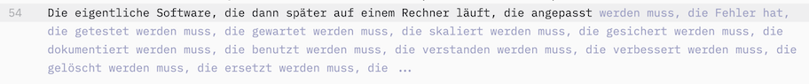

# Auftakt zur Serie: Prompt-driven Development

> tl;dr: Software-Entwicklung wird aufgrund von KI nie mehr sein wie vor noch einem Jahr. Prompt-driven Development ist die aktuellste Umwälzung, die mit Hilfe von natürlicher Sprache den Bau von Software ermöglicht. Ich bin als Softwerker selbst massiv davon betroffen. In einer Serie hier werde ich versuchen, meine Erkenntnisse und Einschätzungen nachvollziehbar zu teilen.

Ich entwickle seit nunmehr als 20 Jahren hauptberuflich Software. Und ich mache es noch immer gerne. Meiner Tochter erklärte ich, dass das sei, wie professionell Lego zu bauen, nur dass das Aufräumen danach viel schneller geht. Kurzum: Mein Hobby ist mein Beruf, und ich bin dankbar dafür.

In der letzten Zeit jedoch wird diese Profession durch KI derart umgekrempelt, dass ich finde, dass es sich lohnt, darüber zu schreiben. Und so starte ich heute eine Serie von Blogposts, in denen ich mich mit dem Thema "Prompt-driven Development" auseinandersetze.

Nicht nur mit den Werkzeugen, sondern auch mit den Methodiken und dem, wie es den Prozess und die Profession verändert. Ich schreibe das alles sehr absolut, aber klar ist:
Das ist alles **meine eigene Meinung**. Es gibt zahlreiche, hervorragende Quellen im Internet, in denen von unzähligen Tech-Fluencern und Software-Entwicklungs-Koryphäen über KI und Softwareentwicklung jede Ecke beleuchtet wird.

Ich habe mich daher lange gefragt, ob es sich lohnt, dass auch ich noch meinen Senf dazu gebe. In den vergangenen zwei Monaten habe ich den gleichen Senf aber an unterschiedlichste Menschen aus meinem Umfeld verteilt und mehr als einmal wurde ich gebeten, ob ich das nicht noch einmal aufschreiben könne. Und auch für mich selbst erhoffe ich eine gewisse therapeutische Wirkung: In Zeiten von enormem Wandel hilft es manchmal, seine eigenen Gedanken auszuspeichern.

Falls Du also Lust hast, Dich mit mir auf diese Reise zu begeben, dann freue ich mich, wenn Du meinen Beiträgen folgst. Und wenn Du Fragen hast, dann schreib sie gerne hier rein. Ich freue mich auf den Austausch.

Letzte Meta-Information, bevor ich zum eigentlichen Inhalt komme. Ich habe vor
- auf KI-generierte Texte weitestgehend zu verzichten. Ansonsten könntet ihr auch direkt mit einem LLM sprechen.
- möglichst auf KI-generierte Bilder, die nur der Auflockerung dienen, zu verzichten. Ich finde die auch immer toll, aber so langsam ermüde ich dabei. Ich versuche, es über guten Inhalt (meist formatierten Text) spannend zu halten.
- Ich bin kein Wissenschaftler und – wie gesagt – gibt es zu jedem dieser Aspekte Experten, die Themen tiefer erschließen. Ich werde dennoch versuchen, nicht zu viele Quellen zu verlinken. Letztlich stört es mir den Lesefluss. Solltet ihr weiterführende Informationen vermissen, schreibt es gerne in die Kommentare. Vielleicht nutze ich diese auch selbst als Quellenangaben, mal schauen.

# Was bezeichne ich als "Prompt-driven development"

Das war die Vervollständigung meines Editors, als ich damit anfing, diesen Blogpost zu schreiben.

Bin ich damit schon eigentlich jetzt fertig mit dem Artikel? 🤔

Nein, natürlich nicht. Aber es zeigt, wie sehr KI schon in meinem täglichen Leben angekommen ist. Und mit Prompt-driven Development geht das ganze einen Schritt weiter.

# Prompt-driven development – in eigenen Worten

"Prompt-driven Development **setzt beim Erstellen von Software "die KI" auf den Fahrersitz**. Anstatt dass ich als Entwickler Software schreibe und einen Co-Piloten dabei habe, der mich unterstützt, wenn ich ihn frage, übergebe ich ihm das Steuer und sage ihm, wohin ich will. Er fährt dann die Strecke und ich kann mich entspannt zurücklehnen.

So ist zumindest der Sales-Pitch. In Wirklichkeit ist es eher so, dass ich dem Assistenten sage, wohin ich will. Der Assistent fährt und ich sollte dabei ziemlich genau aufpassen, ob er auch den Weg nimmt, den ich implizit im Kopf hatte, als ich ihm das Ziel nannte. Zum Beispiel weil dies der mir bekannteste, kürzeste oder auch sicherste Weg ist.

Es handelt sich also um eine **Inversion der Kontrolle**: Nachdem uns Assistenten bisher in der IDE unterstützten und uns auf Fehler hinwiesen, die wir gerade begingen, drehen wir den Kontrollfluss um und kontrollieren als humanoide die Maschinen. Spätestens an dieser Stelle könnte der Eine oder Andere ein ungutes Bauchgefühl bekommen, ob das denn so eine gute Idee ist. Aber dazu später mehr.

_Der Klarstellung halber: "Prompt-driven development" ist ein von mir derzeit verwendeter Term. Ich habe diesen bisher noch nirgends gesehen. Ich nutze ihn, um ihn bzüglich der Kontroll-Inversion gegenüber "Prompt Engineering" abzugrenzen._

# Hat da jemand Low-Code gesagt?

Wenn wir in Zukunft also mit natürlicher Sprache, die wir alle denken zu beherrschen, Software entstehen lassen können, ist das dann nicht endlich die Möglichkeit, Software-Entwicklung jedem zugänglich zu machen? **"Citizen Developer" in allen Fachabteilungen**?
Insbesondere dieses Versprechen erinnert doch sehr stark an den gerade abgeebbten Hype um Low-Code-Plattformen. Diesen habe ich trotz der schicken Oberflächen und beeindruckenden Demos nicht geglaubt. Warum sollte diesmal alles anders sein? Als "ernsthafter" Softwerker war meine Kern-Kritik an Low-Code-Plattformen im Wesentlichen diese: Komplexität lässt sich nicht reduzieren, nur verlagern. **Low-Code verlagerte diese Komplexität auf die Plattform**, die die Low-Code-Entwicklung ermöglichte.
Das reduziert den initialen Erstellungsaufwand, bringt aber Probleme mit sich:

- Problemanalyse ist oft schwieriger, weil auch Debugger, Tracing, Fehlerbehandlung durch die Plattform bereitgestellt werden müssen.
- Performance-Probleme sind oft schwerer zu diagnostizieren, weil die Plattform die Ausführung der Software steuert.
- Die Weiterentwicklung hängt – wie auch bei Code-basierter Entwicklung – von der Qualität der initialen Software ab und diese fließt aus den Fingern des Erstellers. Oft sind Low-Code Plattformen einzigartig, was spezifisches Training erfordert. Da die Plattformen alle neu und unterschiedlich waren, gab es kaum kollektives Erfahrungswissen.

Zusammen mit den ersten beiden Punkten war damit für mich der Reiz von Low-Code im großen Stil uninteressant. Und da habe ich noch gar nicht über *Vendor-Lock-In* gesprochen.

# Warum ist das nun alles anders?

Der wesentliche Aspekt: Prompt-driven development ist lediglich eine Methode, um Artefakte zu erzeugen, aber auch zu verändern (meist Quellcode, aber zu anderen Aspekten kommen wir später auch noch).

Ok, ich nehme an, ihr habt verstanden, worauf ich hinaus will.

Bei Prompt-driven development entsteht noch immer **Software, "wie wir sie kennen"**. Dies geschieht einfach nur unter Zuhilfenahme von anderen Werkzeugen. Und diese können einen irrsinnig beschleunigen, wenn man sie richtig einsetzt. Und sie können einen mit irrsinniger Beschleunigung in die falsche Richtung schicken, wenn man nicht aufpasst.

Ich versuche im Folgenden, meinen digitalen Werkzeugkoffer, wie es @MartinStrunk immer nennt, zu erweitern, den Umgang mit den Werkzeugen zu erlernen. Darüber hinaus will ich verstehen, was wir rundherum an unserer Methodik anpassen sollten, um die Beschleunigung möglichst gut ausnutzen zu können.

# Auch mal ~Hand~ einen Agenten anlegen?

Damit hier nicht nur Text steht, sondern damit ihr es selbst erfahren könnt, **empfehle ich euch, selbst einmal einen Prompt los zu schicken.**
Bei mir begann die Faszination mit bolt.new, einer Prompt-driven Web-IDE. Da könnt ihr prompten und bekommt direkt im Browser das Ergebnis. Einschränkung: Hier laufen nur Web-Technologien.
Der Einstieg ist sehr einfach, das Internet voll mit Videos und Beispielprojekten. Aber nichts ist so eindrücklich, als wenn man es selbst einmal mit eigenen Augen gesehen hat.

Daher: Investiert einmal zehn Minuten, um eine App, die ihr schon immer bauen wolltet, anzureißen. Und wenn ihr selbst Software-Entwickler seid, dann rate ich euch dazu, 20€ zu investieren und auf diesem Projekt mit Hilfe von bolt rum zu iterieren. Dann bekommt ihr schon ein erstes Gefühl dafür, wo es hin geht.

Beim nächsten Mal ... habe ich heute auch noch keine Ahnung, worüber ich schreiben werde, aber das Feld ist groß: Methodik während des Code schreiben lassens, Tools um mit dem Wust an Code umzugehen, Testing und Mocking, Software-Architektur – mal sehen.

Ich freue mich jedenfalls über Anregungen und Kommentare!

Rants zu Thema No-Code werden natürlich auch immer gerne genommen ;)

