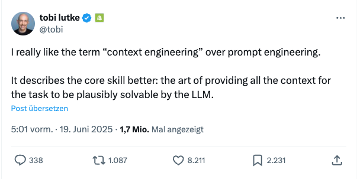

# Context is all you need

> tl;dr: "Context Engineering ist die Kernkompetenz für erfolgreiche KI-gestützte Softwareentwicklung. Der Schlüssel liegt daring, phasenspezifisch die passenden Tools und den relevantem Kontext bereit zu stellen."

Wie schon geschrieben erlebe ich als Entwickler gerade die größte Umwälzung unserer Profession seit der Einführung des Internets. Während ich früher meiner Tochter erklärte, dass Programmieren wie professionelles Lego-Bauen sei (nur dass das Aufräumen schneller geht), muss ich heute hinzufügen: "Und neuerdings erkläre ich dem Computer auf Deutsch, was ich bauen möchte. Und dann macht er einen wie ein Lego-Bau-Roboter das großteils selbst"

Dabei frage ich mich immer wieder: Wie kann es sein, dass diese LLMs so verdammt gut raten? "Verstehen" im menschlichen Sinne tun sie ja nicht, egal wie oft sie das behaupten. Dann denke ich an Transformer und das berühmte Paper "Attention is all you need" aus 2017: Aus dem Bekannten wird mittels statistischer Methoden der wahrscheinlichste  Fortgang ermittelt. Man könnte auch sagen: Aus dem Kontext abgleitet, wie es zur Aufmerksamkeit ("Attention") eben gut passt. Und dann wird mir klar: Man kann Aufmerksamkeit lenken.

Wie immer bin ich natürlich nicht der einzige mit dem Gedanken, am besten brachte es Tobi Lütke, der Nerd-CEO von Shopify, kürzlich auf den Punkt:

## Context Engineering schlägt Prompt Engineering

Dieser Perspektivwechsel ist fundamental. Prompt Engineering fragt: "Wie soll das LLM arbeiten?" Context Engineering fragt: "Welche Informationen braucht es?"

Es ist wie der Unterschied zwischen einem Mikromanager und einem guten Teamleiter. Der Mikromanager erklärt jeden Arbeitsschritt im Detail. Der gute Teamleiter sorgt dafür, dass alle relevanten Informationen verfügbar sind und lässt das Team dann arbeiten.

**Praktisches Beispiel:**
- **Prompt Engineering**: "Schreibe sauberen, gut dokumentierten Code mit Error Handling und folge den SOLID-Prinzipien..."
=> Imperativ

- **Context Engineering**: Hier sind die bestehende Architektur, die Coding Standards, die aktuellen Tests und ähnliche Implementierungen im Projekt.
=> Kontextuell explorativ

_Anmerkung: Seitdem ich anfing, diesen Post zu schreiben, quillt das Internet über mit unterschiedlichen Definitionen von "Context-Engineering". Ich verwende den Term hier naiv: Ohne Frameworks, Tools oder anderen heißen Sch..., mit dem man "Context Engineering" anscheinen auch assoziieren kann: Für mich heißt der Begriff nur, dass ich als Entwickler mir bewusste Gedanken zum Kontext der Konversation mit einem LLM mache und dabei aktiv diesen gestalte._

Auch das ist alles nicht neu: Seit es LLMs gab, haben sich viele schlaue Menschen Gedanken gemacht, wie man dem LLM möglichst gut klar macht, in welchem Kontext es bitte arbeiten möge.

## Die Grenzen bisheriger Ansätze

In den letzten zwei Jahren habe ich verschiedene Ansätze zur Kontext-Bereitstellung beobachtet und selbst ausprobiert:

### Der Mega-Prompt Ansatz

**Die Idee**: Alles in einen riesigen System Prompt packen - von Coding Standards über Architektur-Prinzipien bis hin zu Deployment-Prozessen.

**Das Problem**: Diese Prompts werden schnell unübersichtlich, stoßen an Token-Limits und verwässern durch irrelevante Informationen. Ein 5000-Zeichen Prompt mit allem von API-Dokumentation bis zu Git-Workflows hilft nicht, wenn ich nur einen kleinen Bug fixen will.

### Der Agenten-Ansatz
**Die Idee**: Separate Systeme sammeln und filtern automatisch den relevanten Kontext. Ein Agent durchsucht Files, ein anderer analysiert Dependencies, ein dritter entscheidet über Relevanz.

**Das Problem**: Agenten arbeiten selektiv und bremsen so die natürliche Flexibilität von LLMs aus. Sie fügen eine zusätzliche Abstraktionsschicht hinzu, die oft mehr Probleme schafft als löst. Das LLM wird zum passiven Empfänger statt zum aktiven Orchestrator.

### Der IDE-Integration Ansatz
**Die Idee**: Der Entwickler wählt relevante Files und Kontext aus, die IDE übergibt diese an das LLM.

**Das Problem**: Das überfordert uns Menschen. Welche 10 von 200 Files sind für diese Änderung relevant? Wir sind schlecht darin, Kontext-Relevanz einzuschätzen, besonders bei komplexen Systemen. Außerdem ist es inkonsistent - jeder macht es anders.

## Meine Erfahrungen

Ich war nie Experte in einem dieser Ansätze, aber ich habe sie alle ausprobiert und dabei - auch ohne Evals oder quantitative Analysen - mitbekommen, wie sich unterschiedliche Ansätze verhalten.

Über die Zeit habe ich mir verschiedene Tools und Methoden überlegt, wie ich ein LLM auch über komplexe Aufgaben oder längere Interaktionen vorhersagbar steuern kann. Mit großen Prompts, mit Agenten, mit permanent getunetem Kontext. Aber gerade über einen längeren Zeitraum fühlte sich das nicht passend an, besonders wenn man in einem Dialog über mehrere Prozessschritte arbeitet.

**Das Problem der langen Dialoge**: Je länger die Interaktion, desto mehr verliert sich der ursprüngliche Kontext. Das LLM "vergisst" wichtige Informationen oder fokussiert auf die falschen Details. Gleichzeitig wird der Kontext immer unspezifischer, weil man versucht, alles abzudecken.

**Die Erkenntnis**: Dabei fiel mir auf: In verschiedenen Phasen eines Projekts brauchte ich völlig unterschiedliche
Informationen. Statt zu versuchen, alles gleichzeitig bereitzustellen, sollte man phasenspezifisch denken.

Das war der Moment, in dem mir klar wurde: Context Engineering ist nicht nur eine andere Art, Prompts zu schreiben. Es ist eine fundamental andere Herangehensweise an die Zusammenarbeit mit LLMs: Es geht darum, als Engineer dem LLM zum richtigen Zeitpunkt die passenden Informationen an die Hand zu geben, damit dieser dann voll seine Stärken bei Geschwindigkeit, Übersicht und Sorgfalt ausspielen kann!

Aber wie diese Erkenntnis in konkrete Werkzeuge und Methoden umsetzen? Das wird Inhalt eines weiteren Posts...

---

*Dieser Blogpost ist Teil meiner Serie über die Transformation der Softwareentwicklung durch KI. Wenn du Fragen hast oder deine eigenen Erfahrungen teilen möchtest, freue ich mich über den Austausch in den Kommentaren.*
