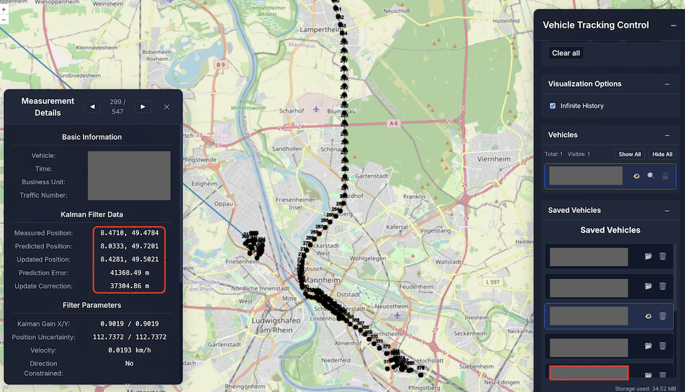
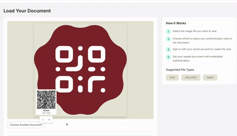

In meinem [vorherigen Artikel über Prompt-driven Development](prompt-driven-development.md) habe ich darüber geschrieben, wie KI unsere Entwicklungsmethodik grundlegend verändert. Heute möchte ich einen Schritt weitergehen und über etwas sprechen, das mir jeden Tag klarer wird: Der wahre Wert von KI-Assistenz liegt nicht darin, uns zu "10x Developern" zu machen.

## Die Grenzen der Effizienz-Metrik

Die Tech-Branche ist besessen von Effizienz. Wir messen Story Points, Velocity, Lines of Code (hoffentlich nicht mehr), Commits pro Tag und unzählige andere Metriken. Dann kam KI, und plötzlich sprachen alle von "10x Developern" oder sogar "100x Developern".

Aber hier liegt ein fundamentales Missverständnis: **Der revolutionäre Wert von KI lässt sich nicht in einer simplen Effizienzsteigerung messen.**

Warum? Weil der größte Impact von KI nicht darin besteht, bekannte Aufgaben schneller zu erledigen, sondern darin, das Unmögliche möglich zu machen.

## Der Quantensprung: Von "Keine Ahnung wie" zu "Machbar"

Was meine ich damit? Lasst mich drei persönliche Beispiele teilen:

### 1. Der springende Zug

Bei der DB Systel arbeite ich mit dem Streaming von Zug-Positionsdaten. Ein bekanntes Problem: In Werkshallen ist das GPS-Signal schwach, was zu "springenden" Zügen auf der Karte führt. Züge bewegen sich jedoch zum Glück fast immer auf Gleisen.

Vor KI hätte ich mich durch akademische Paper wühlen müssen, um eine Lösung zu finden. Mit Claude konnte ich verschiedene Ansätze evaluieren – von Geofences bis hin zu Kalman-Filtern, von denen ich zuvor nie gehört hatte. Nach einigen Iterationen und der Erkenntnis, dass sich Züge gerichtet mit hoher Kontinuität bewegen, konnte ich einen gerichteten Kalman-Filter entwickeln.

Das Ergebnis? Eine Lösung für ein Problem, bei dem ich ohne KI nicht einmal gewusst hätte, wo ich anfangen soll.

 "Kalman-Filter in Aktion – manchmal gibt es auch Fehlsignale von 40km – zumindest in meiner lokalen Testumgebung"

### 2. Digitale Versiegelung mit Canvas

Für ein privates Projekt brauchte ich eine Möglichkeit, QR-Codes pixelgenau auf Bilder zu platzieren. Die Lösung: HTML Canvas – etwas, womit ich noch nie gearbeitet hatte.

Unmöglich? Nicht mit KI. Mit bolt.new war der grundlegende Teil in Sekunden fertig. Und für Drag-and-Drop-Funktionalität auf dem Canvas – etwas, wovon ich absolut keine Ahnung hatte – half mir Claude.

Ohne KI hätte ich Tage damit verbracht, Tutorials zu durchforsten und grundlegende Konzepte zu verstehen. Mit KI konnte ich mich direkt auf die Problemlösung konzentrieren.

 "Drag-and-Drop in einem 2D Canvas einer HTML-Seite – ist es nicht wunderschön 🤩"

### 3. MCP-Server für strukturierte Entwicklung

Um meine Arbeit mit KI zu optimieren, wollte ich einen MCP-Server entwickeln, der mich interaktiv durch Entwicklungsphasen führt und ein "Gedächtnis" über die aktuelle Feature-Entwicklung aufbaut.

Ich kannte zwar MCP und das TypeScript SDK, aber die Details sind komplex. Dank GitMCP konnte ich Claude die entsprechenden Dokumentationen bereitstellen – und es hat sich praktisch selbst implementiert.

"[Vibe Feature-Entwicklungs-MCP-Server](https://github.com/mrsimpson/vibe-feature-mcp) – Er verbessert sich parallel zum Schreiben dieses Blogposts selbst 🤓🤯"

## Es geht nicht um Geschwindigkeit, sondern um Möglichkeiten

In all diesen Fällen war der Wert nicht primär die Zeitersparnis. Der wahre Wert lag darin, dass ich Dinge umsetzen konnte, die ich ohne KI-Unterstützung entweder gar nicht oder nur mit enormem Aufwand hätte realisieren können.

KI verschiebt die Grenze zwischen "zu komplex für mich" und "machbar" dramatisch. Sie demokratisiert Expertise und macht spezialisiertes Wissen zugänglich, ohne dass wir jahrelang in jedem Bereich Erfahrung sammeln müssen.

## Die neue Rolle des Entwicklers

Diese Verschiebung verändert fundamental, was es bedeutet, ein Entwickler zu sein:

1. **Vom Code-Schreiber zum Problemlöser**: Wir können uns auf die eigentliche Problemstellung konzentrieren, statt uns in technischen Details zu verlieren.

2. **Von der Spezialisierung zur Vielseitigkeit**: Wir können uns in neue Domänen wagen, ohne jahrelange Einarbeitung.

3. **Von der Umsetzung zur Innovation**: Unsere wertvollste Fähigkeit wird nicht mehr das Wissen über spezifische Technologien, sondern die Fähigkeit, Probleme zu identifizieren und kreative Lösungsansätze zu finden.

## Die Angst überwinden

Viele Entwickler zögern noch, KI vollständig in ihren Workflow zu integrieren. Die Gründe sind vielfältig: Angst vor Kontrollverlust, Sorge um die eigene Relevanz oder einfach Gewohnheit.

Aber genau hier liegt eine enorme Chance: Wer jetzt lernt, mit KI zu innovieren, zu explorieren und neue Wege zu gehen, wird nicht ersetzt – sondern wird zum Pionier einer neuen Art des Entwickelns.

Und für Manager mit technischem Hintergrund: Traut euren Mitarbeitern mehr Kreativität und Eigenverantwortung zu. Die Kombination aus menschlicher Kreativität und KI-Unterstützung kann zu Lösungen führen, die vorher undenkbar waren.

## Fazit: Der wahre 10x-Effekt

Der wahre "10x-Effekt" von KI liegt nicht darin, dass wir zehnmal so viel Code in der gleichen Zeit schreiben. Er liegt darin, dass wir zehnmal so viele Probleme lösen können, weil die technische Umsetzung nicht mehr die limitierende Hürde ist.

KI macht uns nicht nur zu schnelleren Entwicklern – sie kann uns zu mutigeren Innovatoren machen.

Was ist deine Erfahrung? Hast du schon erlebt, wie KI dir geholfen hat, etwas zu realisieren, was dir vorher unmöglich erschien? Teile deine Geschichte in den Kommentaren!
