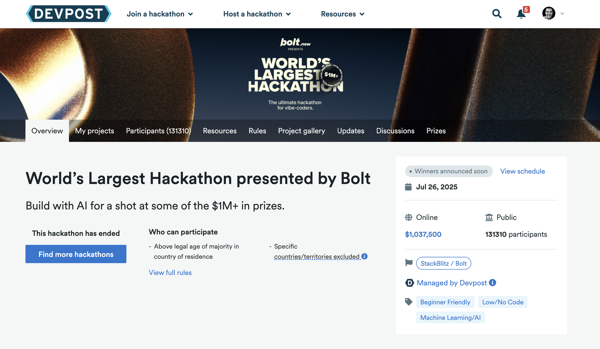
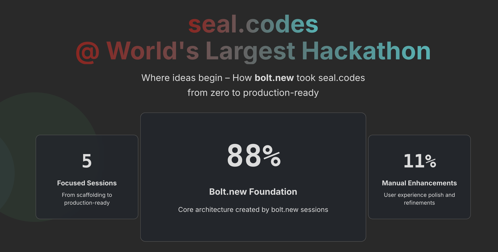

Nach meinem [letzten Blogpost über den wahren Wert von KI in der Softwareentwicklung](von-unmoeglich-zu-machbar.md) möchte ich das Ganze an einem konkreten Beispiel aus der realen Welt zeigen: Anhand meiner Erfahrung mit dem wohl ambitioniertesten Hackathon aller Zeiten.

## Der größte Hackathon der Welt: Ein Phänomen

StackBlitz hat nicht einfach nur einen Hackathon organisiert – sie haben eine Bewegung geschaffen. Mit über 1 Million Dollar Preisgeld, mehr als 126.000 Teilnehmern und der Unterstützung großer Tech-Unternehmen ist das kein typisches Wochenend-Coding-Event. Die Marketing-Kampagne, die Größenordnung, die investierten Ressourcen – es ist klar, dass sie alles tun, um ihr Produkt bolt.new maximal zu promoten.

Aber um bolt.new soll es gar nicht so sehr gehen – sondern darum, wie man als Solo-Entwickler oder sehr kleines Team innovieren kann.

## Die Herausforderung: Etwas wirklich NEUES bauen

Als der Hackathon verlangte, etwas wirklich Innovatives zu entwickeln (nicht schon wieder eine Todo-App!), stand ich vor einer scheinbar unmöglichen Aufgabe. Im Jahr 2025 ist fast alle Software bereits gebaut worden. Die Welt braucht kein weiteres Social-Network-Klon, keine weitere E-Commerce-Plattform. Jedes offensichtliche Problem wurde bereits dutzende Male gelöst.

Aber diese Einschränkung zwang mich zu tieferem Nachdenken: Was bedeutet "wirklich neu" überhaupt? Was macht etwas "authentisch" im Gegensatz zu nur einem weiteren Klon? Wie können wir beweisen, wer ein Bild zuerst erstellt hat? Was ist mit der Epidemie von KI-generierten Fakes, gestohlenem Content und digitalen Täuschungen, die Creator überall plagen?

## Der Durchbruch: 4.000 Jahre alte Weisheit

Die Erleuchtung kam, als ich meinen Sohn und seinen Freund beobachtete: Der Freund hatte zum Geburtstag Siegelwachs geschenkt bekommen und siegelte nun alles, was ihm wichtig war. Mein Sohn nahm jeden einzelnen der Briefe ehrfürchtig entgegen.

In diesem Moment wurde mir klar: Seit Menschen zum ersten Mal königliche Siegel in Tontafeln und Wachs drückten, lösen wir Authentizität mit sichtbaren Vertrauenszeichen. Das waren keine versteckten kryptographischen Rätsel – es waren sofort erkennbare Symbole, die augenblicklich kommunizierten, wer hinter einem Dokument stand.

Warum haben wir nicht etwas Vergleichbares für digitale Bilder oder Dokumente? Nicht komplexe kryptographische Signaturen, die für Nutzer unsichtbar bleiben, sondern etwas so sofort erkennbares und universell verständliches wie diese alten Siegel – sichtbar, aber im Gegensatz zum Wachssiegel scanbar und sofort verifizierbar von jedem mit einem Smartphone.

## Warum wir digitales Vertrauen brauchen

Wir leben in einer Zeit der digitalen Vertrauenskrise. KI kann in Sekunden täuschend echte Bilder generieren, Deepfakes werden täglich besser, und gestohlene Inhalte sind mit Copy-Paste einfacher denn je. Gleichzeitig werden unsere wichtigsten visuellen Schöpfungen – Kunstwerke, Fotografien, Designs, Memes – fast ausschließlich digital erstellt und geteilt.

Aber wie beweist man heute, dass ein Bild wirklich von der angegebenen Person stammt? Wie kann ein Künstler sicher sein, dass seine Werke nicht gestohlen und als fremde ausgegeben werden? Wie können Creator ihre Originalität schützen?

Die bestehenden Lösungen sind entweder:
- **Zu komplex**: PKI-Zertifikate, die niemand versteht
- **Unsichtbar**: Digitale Signaturen, die man nicht sieht
- **Zentralisiert**: Abhängig von großen Plattformen
- **Teuer**: Enterprise-Lösungen für normale Menschen unzugänglich

## Was seal.codes anders macht

seal.codes bringt das uralte Konzept der Siegel ins digitale Zeitalter – aber richtig:

**🔍 Sichtbar und sofort erkennbar**
Statt unsichtbarer Metadaten gibt es einen QR-Code, der direkt im Bild sichtbar ist. Jeder kann sofort sehen: "Dieses Bild ist mit einem Siegel versehen."

**📱 Universell verifizierbar**
Jeder mit einem Smartphone kann den QR-Code scannen und sofort sehen, wer das Bild signiert hat, wann es erstellt wurde und ob es verändert wurde.

**🔒 Privacy-First**
Die Bilder verlassen für das Siegeln nicht Gerät. seal.codes läuft komplett im Browser – keine Cloud, keine Server, die deine sensiblen Inhalte sehen.

**🌐 Offline-fähig**
Der QR-Code enthält alle Verifikationsdaten. Auch ohne Internet kann jeder die Authentizität prüfen.

**👤 Soziale Identität statt Krypto-Komplexität**
Statt komplizierter Zertifikate nutzt seal.codes deine bestehenden Identitäten: Google, GitHub. Vertrauen basiert auf Identitäten, die Menschen bereits kennen und verstehen.

**💰 Demokratisch zugänglich**
Keine Enterprise-Preise, keine Abonnements. Jeder kann seine Bilder siegeln.

[Schau es Dir selbst an!](https://youtu.be/JRCBtjyHmIo)

Das ist nicht nur ein weiteres Tool – es ist ein Paradigmenwechsel. Von versteckter Kryptographie zu sichtbarem Vertrauen. Von komplexen Zertifikaten zu verständlichen Identitäten. Von zentralisierten Plattformen zu dezentraler Verifikation.

## Die Entwicklungsreise: Zwei Tools, ein Ziel

Mit der Vision klar vor Augen wurde die technische Umsetzung zu einem orchestrierten Tanz zwischen verschiedenen KI-Tools:

### Bolt.new: Scaffolding und visuelle Magie

Bolt.new war perfekt für das, was es am besten kann: Schnelles Prototyping und visuelle Komponenten. In 5 fokussierten Sessions entstanden:

🏗️ **Session 1: Foundation Architecture** - 5.400 LoC
Die grundlegende App-Struktur, UI-Komponenten, und das erste UI-Layout. Bolt.new glänzt hier mit seiner Fähigkeit, sofort sichtbare Ergebnisse zu liefern.

🎨 **Session 2: Verification System** - 3.000 LoC  
QR-Code-Generierung, Bild-Embedding, visuelle Feedback-Systeme. Die Stärke von Bolt.new: Komplexe visuelle Interaktionen werden sofort sichtbar und testbar.

🔐 **Session 3: Authentication & Backend** - 3.700 LoC

OAuth-Integration, Benutzer-Management, API-Struktur. Auch Full-Stack-Entwicklung (natürlich nur mit den Partnern von Stackblitz, in diesem Fall Supabase) geht super schnell und einfach.

### Q Developer & Claude: Engineering Excellence

Was Bolt.new nicht erzählt: Zwischen jeder Session wechselte ich zu meinem Kollegen Claude für die Engineering-Aufgaben, die man nicht direkt sieht, die aber mindestens ebenso zählen:

**🔧 Refactoring mit der IDE und Claude**

- Code-Struktur optimieren
- Test schreiben und schreiben lassen
- TypeScript-Typen verfeinern

**🧠 Architektur-Entscheidungen mit Claude**

- Ideenfindung zu Lösungsansätzen
- Komplexe Algorithmus-Implementierungen
- Visualisieren der Architektur

**🔍 Session 4 & 5: Verfeinerung** - 1.230 LoC

Die letzten beiden Sessions waren fast ausschließlich Engineering: Signatur-Verifikation perfektionieren, Edge Cases abfangen, UI-Performance optimieren.

## Das Ergebnis: 13.330 Zeilen, aber nicht nur Code

**Über 90% KI-generiert** – aber 100% durchdacht. Nicht jede Zeile wurde überprüft, aber jede Funktion getestet, jede Sicherheitslücke geschlossen. Das ist der Unterschied zwischen "KI hat Code geschrieben" und "KI hat mir geholfen, Software zu entwickeln".

Dieser hybride Ansatz – KI für schnelle Innovation, menschliches Engineering für Qualität – ist das, was 13.330 Zeilen produktionsreifen Code möglich machte. Rohe KI-Ausgabe reicht nicht; man braucht echte Software-Engineering-Fähigkeiten, um etwas zu schaffen, das tatsächlich zuverlässig funktioniert.

## Was seal.codes einzigartig macht

Das Ergebnis ist mehr als nur ein Tool – es ist eine neue Art, über digitales Vertrauen zu denken. seal.codes macht Vertrauen wieder sichtbar, verständlich und zugänglich. In einer Welt voller KI-generierter Fakes und digitaler Täuschungen bringt es die Ehrfurcht zurück, die mein Sohn vor den gesiegelten Briefen seines Freundes hatte.

## Komplette Transparenz

Ich habe den gesamten Entwicklungsprozess auf seal.codes/hackathon dokumentiert – wahrscheinlich die detaillierteste Aufschlüsselung, wie Bolt.new tatsächlich in diesem Wettbewerb verwendet wurde.

## 🗳️ Deine Unterstützung

Falls diese Innovation bei dir Anklang findet, wäre ich super dankbar für deine Stimme 
[auf der Einreichung auf Devpost](https://devpost.com/software/seal-codes-digital-seals-for-the-modern-age)

Jede Stimme hilft den Juroren zu sehen, dass dies ein echtes Problem angeht, das täglich Millionen von Creators, Künstlern und Fotografen betrifft.

## Probier es selbst aus: 🔗 https://seal.codes

Hier wird es konkret: Ich brauche deine Hilfe! seal.codes ist noch jung, und wie jede innovative Software hat sie sicher noch Ecken und Kanten, die ich übersehen habe.

**Teste seal.codes und hilf mir, es besser zu machen:**

🔍 **Finde Bugs** - Probiere verschiedene Bildgrößen, Formate, Browser aus
📱 **Teste die QR-Codes** - Funktioniert das Scannen auf deinem Smartphone?
🔒 **Prüfe die Sicherheit** - Kannst du das System austricksen?
💡 **Teile Ideen** - Welche Features fehlen dir? Welche Use Cases habe ich übersehen?

Jeder Test, jedes Feedback, jeder gefundene Fehler macht seal.codes besser. Und ehrlich gesagt: Es macht auch mehr Spaß, wenn Menschen das Tool tatsächlich nutzen, statt nur darüber zu lesen.

**Besonders interessant wären Tests mit:**
- Sehr großen Bilddateien
- Verschiedenen Bildformaten (PNG, JPG, WebP)
- Mobilen Browsern
- Verschiedenen QR-Code-Scannern

Sieh dir auch die komplette Entwicklungsgeschichte an: 🔗 [https://seal.codes/hackathon](https://seal.codes/hackathon)

Welche Probleme löst du mit KI-unterstützter Entwicklung? Teile deine Innovationen in den Kommentaren! 👇

#WorldsLargestHackathon #BoltNew #DigitalTrust #Innovation #AI #seal.codes #Hackathon #TechInnovation #SoftwareDevelopment

---

# 🔐 From Vision to Reality: My Journey in the World's Largest Hackathon with seal.codes

Following up on my recent blog post about AI's true value in software development, I want to share a concrete real-world example: my experience with what might be the most ambitious hackathon ever organized.

## The World's Largest Hackathon: A Phenomenon

StackBlitz didn't just organize a hackathon - they created a movement. With $1M+ in prizes, 126,000+ participants, and the backing of major tech companies, this isn't your typical weekend coding event. The marketing campaign, the scale, the resources invested - it's clear they're doing everything to maximize promotion of their product bolt.new.

But this isn't really about bolt.new - it's about how solo developers or very small teams can innovate.

## The Challenge: Build Something Genuinely NEW

When the hackathon required building something truly innovative (not another todo app!), I faced what seemed like an impossible challenge. In 2025, almost all software has already been built. The world doesn't need another social network clone, another e-commerce platform. Every obvious problem has been solved a dozen times over.

But this constraint forced me into deeper thinking: What does "genuinely new" even mean in software? What makes something "authentic" versus just another clone? How can we prove who created an image first? What about the epidemic of AI-generated fakes, stolen content, and digital deceptions plaguing creators everywhere?

## The Breakthrough: 4,000 Years of Wisdom

The revelation came from watching my son and his friend: The friend had received sealing wax as a birthday gift and was now sealing everything important to him. My son received each of the letters with reverence.

In that moment it became clear to me: Since humans first pressed royal seals into clay tablets and wax, we've solved authenticity with visible trust marks. These weren't hidden cryptographic puzzles—they were immediately recognizable symbols that instantly communicated who stood behind a document.

Why don't we have something equivalent for digital images? Not complex cryptographic signatures that remain invisible to users, but something as immediately recognizable and universally understandable as those ancient seals—visible, scannable, and instantly verifiable by anyone with a smartphone.

## Why We Need Digital Trust

We live in an era of digital trust crisis. AI can generate deceptively real images in seconds, deepfakes get better daily, and stolen content is easier than ever with copy-paste. Meanwhile, our most important visual creations—artworks, photographs, designs, memes—are created and shared almost exclusively digitally.

But how do you prove today that an image really comes from the stated person? How can an artist be sure their works aren't stolen and passed off as someone else's? How can creators protect their originality?

Existing solutions are either:
- **Too complex**: PKI certificates that nobody understands
- **Invisible**: Digital signatures you can't see
- **Centralized**: Dependent on big platforms
- **Expensive**: Enterprise solutions inaccessible to normal people

## What Makes seal.codes Different

seal.codes brings the ancient concept of seals into the digital age—but properly:

**🔍 Visible and immediately recognizable**
Instead of invisible metadata, there's a QR code directly visible in the image. Everyone can immediately see: "This image is sealed."

**📱 Universally verifiable**
Anyone with a smartphone can scan the QR code and immediately see who signed the image, when it was created, and whether it was modified.

**🔒 Privacy-First**
Your images never leave your device. seal.codes runs completely in the browser—no cloud, no servers seeing your sensitive content.

**🌐 Offline-capable**
The QR code contains all verification data. Even without internet, anyone can check authenticity.

**👤 Social Identity instead of Crypto-Complexity**
Instead of complicated certificates, seal.codes uses your existing identities: Google, GitHub. Trust is based on identities people already know and understand.

**💰 Democratically accessible**
No enterprise prices, no subscriptions. Anyone can seal their images.

[See for yourself!](https://youtu.be/JRCBtjyHmIo)

This isn't just another tool—it's a paradigm shift. From hidden cryptography to visible trust. From complex certificates to understandable identities. From centralized platforms to decentralized verification.

## The Development Journey: Three Tools, One Goal

With the vision clear, technical implementation became an orchestrated dance between different AI tools:

### Bolt.new: Scaffolding and Visual Magic

Bolt.new was perfect for what it does best: rapid prototyping and visual components. In 5 focused sessions:

🏗️ **Session 1: Foundation Architecture** - 5,400 LOC
The basic app structure, React components, and first UI layout. Bolt.new shines here with its ability to deliver immediately visible results.

🎨 **Session 2: Verification System** - 3,000 LOC
QR code generation, image embedding, visual feedback systems. Bolt.new's strength: complex visual interactions become immediately visible and testable.

🔐 **Session 3: Authentication & Backend** - 3,700 LOC
OAuth integration, user management, API structure. Here too, Bolt.new helped with rapid iterations and immediate visual feedback.

### Q Developer & Claude: Engineering Excellence

What Bolt.new doesn't tell you: Between each session, I switched to my colleague Claude for the engineering tasks you don't directly see, but which matter just as much:

**🔧 Refactoring with Q Developer**
- Optimize code structure
- Identify performance bottlenecks
- Close security gaps
- Refine TypeScript types

**🧠 Architecture Decisions with Claude**
- Complex algorithm implementations
- Cryptographic security for image verification
- Error handling strategies
- API design patterns

**🔍 Session 4 & 5: Refinement** - 1,230 LOC
The last two sessions were almost exclusively engineering: perfecting signature verification, catching edge cases, optimizing UI performance.

## The Result: 13,330 Lines, But Not Just Code

**88% AI-generated**—but 100% thoughtful. Not every line was reviewed, but every function tested, every security gap closed. That's the difference between "AI wrote code" and "AI helped me develop software."

This hybrid approach—AI for rapid innovation, human engineering for quality—is what made 13,330 lines of production-ready code possible. Raw AI output isn't enough; you need real software engineering skills to create something that actually works reliably.

## What Makes seal.codes Unique

The result is more than just a tool—it's a new way of thinking about digital trust. seal.codes makes trust visible, understandable, and accessible again. In a world full of AI-generated fakes and digital deceptions, it brings back the reverence my son had for his friend's sealed letters.

## Complete Transparency

I've documented the entire development process at seal.codes/hackathon—probably the most detailed breakdown of how Bolt.new was actually used in this competition.

## 🗳️ Your Support Needed!

If this innovation resonates with you, I'd be incredibly grateful for your vote 
[on the submission on Devpost](https://devpost.com/software/seal-codes-digital-seals-for-the-modern-age)

Every vote helps judges see that this addresses a real problem affecting millions of creators, artists, and photographers daily.

## Try it yourself: 🔗 seal.codes

Here's where it gets concrete: I need your help! seal.codes is still young, and like any innovative software, it surely has rough edges I've overlooked.

**Test seal.codes and help me make it better:**

🔍 **Find bugs** - Try different image sizes, formats, browsers
📱 **Test QR codes** - Does scanning work on your smartphone?
🔒 **Check security** - Can you trick the system?
💡 **Share ideas** - What features are missing? What use cases did I overlook?

Every test, every feedback, every bug found makes seal.codes better. And honestly: it's more fun when people actually use the tool instead of just reading about it.

**Particularly interesting would be tests with:**
- Very large image files
- Different image formats (PNG, JPG, WebP)
- Mobile browsers
- Various QR code scanners

Also check out the complete development story: 🔗 [https://seal.codes/hackathon](https://seal.codes/hackathon)

What problems are you solving with AI-assisted development? Share your innovations in the comments! 👇

#WorldsLargestHackathon #BoltNew #DigitalTrust #Innovation #AI #seal.codes #Hackathon #TechInnovation #SoftwareDevelopment
